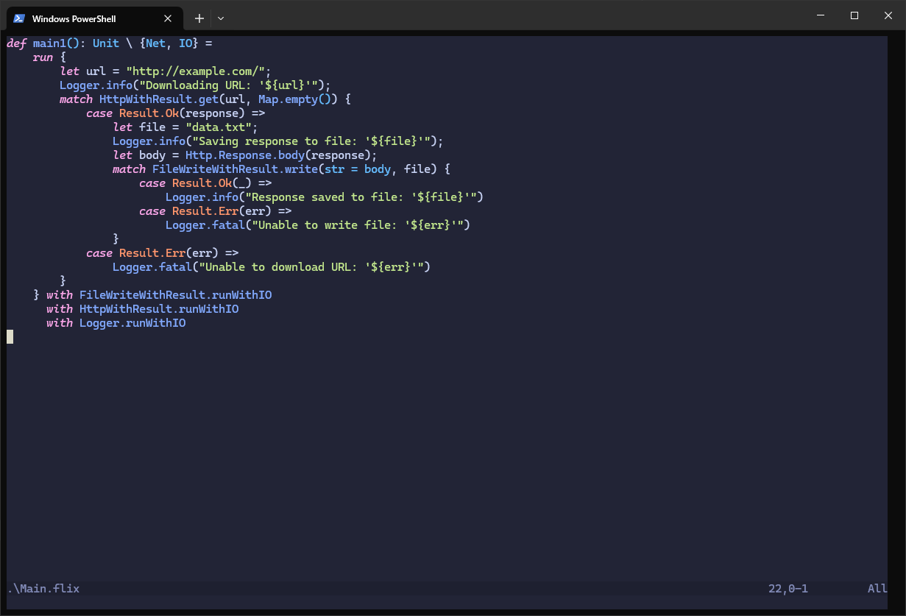

# Getting Started

Getting started with Flix is straightforward. All you need is [Java version 21+](https://adoptium.net/temurin/releases/).

You can check if Java is installed and its version by typing:

```shell
$ java -version
```

which should print something like:

```
openjdk version "21" 2023-09-19 LTS
OpenJDK Runtime Environment Temurin-21+35 (build 21+35-LTS)
OpenJDK 64-Bit Server VM Temurin-21+35 (build 21+35-LTS, mixed mode, sharing)
```

If Java is not installed or your version is too old, a newer version can be
downloaded from [Adoptium](https://adoptium.net/temurin/releases/).

Once you have Java 21+ installed there are two ways to proceed:

- You can use the [Flix VSCode extension](https://marketplace.visualstudio.com/items?itemName=flix.flix) (__highly recommended__) or
- You can run the Flix compiler from the command line.

### Using Flix from Visual Studio Code (VSCode)

Flix comes with a fully-featured VSCode plugin. Follow these steps to get
started:

> 1. Create a new empty folder (e.g. `my-flix-project`).
> 2. Open VSCode and choose `File -> Open Folder`.
> 3. Create a new file called `Main.flix` in the folder.
> 4. VSCode will ask you want to search the marketplace for extensions. Say "Yes".
> 5. The Flix _extension_ will be downloaded and installed. Once done, it will
>    ask if you want to download the Flix _compiler_. Say "Yes" again.
> 6. When you see "Starting Flix" followed by "Flix Ready!" everything should be ready.

A screenshot of the Flix Visual Studio Code extension in action:


### Using Flix from Neovim

Flix can also be used from [Neovim](https://neovim.io/). Follow these steps to
get started:
- the [official plugin](https://github.com/flix/nvim) relies on features released in Neovim 0.11
- check the version of neovim installed

```shell
nvim --version
```

#### Neovim Flix plugin

There is a Lua [plugin](https://github.com/flix/nvim) which provides an LSP configuration for the native neovim lsp, and several functions to interact with the flix cli. It's repo has detailed installation and configuration instructions.
It can be installed with a plugin manager of choice or cloned locally into your neovim runtime path.

> Previously [lspconfig](https://github.com/neovim/nvim-lspconfig) provided LSP functionality to neovim and lsp configurations. However, after version 0.11 neovim has LSP built in, lspconfig only provides configurations for common lsp servers. This makes its installation less necessary but it is still recommended.



### Using Flix from Emacs

Flix can be used from [Emacs](https://www.gnu.org/software/emacs/) as well by installing the [flix-mode](https://codeberg.org/mdiin/flix-mode) package. Follow the instructions there to get started writing Flix code in Emacs.

### Using Flix from the Command Line

Flix can also be used from the command line. Follow these steps:

> 1. Create a new empty folder (e.g. `my-flix-project`).
> 2. Download the latest `flix.jar` from [https://github.com/flix/flix/releases/latest](https://github.com/flix/flix/releases/latest) and put it into the folder.
> 3. Enter the created directory (e.g. `cd my-flix-project`) and run `java -jar flix.jar init` to create an empty Flix project.
> 4. Run `java -jar flix.jar run` to compile and run the project.


### Using nix

Flix can also be installed using the [nix package manager](https://nixos.org/).
To install for the currently running shell run:

```shell
$ nix-shell -p flix
```

Or alternatively to install globally:

```shell
$ nix-env -i flix
```

Then run `flix run` in your project directory.

### Troubleshooting

The most common reasons for Flix not working are (a) the `java` command not
being on your `PATH`, (b) the `JAVA_HOME` environmental variable not being set
or being set incorrectly, or (c) having the wrong version of Java installed. To
debug these issues, ensure that:

- The command `java -version` prints the right Java version.
- The `JAVA_HOME` environmental variable is correctly set.
    - On Windows, you can print the variable by typing `echo %JAVA_HOME%`.
    - On Mac and Linux, you can print the variable by typing `echo $JAVA_HOME`.

If you are still stuck, you can ask for help on [Gitter](https://gitter.im/flix/Lobby).
