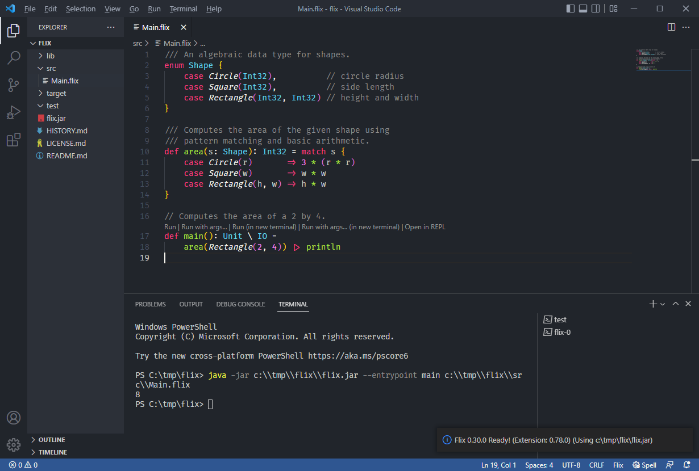

# Getting Started

Getting started with Flix is straightforward. All you need is [Java version 21+](https://adoptium.net/temurin/releases/).

You can check if Java is installed and its version by typing:

```shell
$ java -version
```

which should print something like:

```
openjdk version "21" 2023-09-19 LTS
OpenJDK Runtime Environment Temurin-21+35 (build 21+35-LTS)
OpenJDK 64-Bit Server VM Temurin-21+35 (build 21+35-LTS, mixed mode, sharing)
```

If Java is not installed or your version is too old, a newer version can be
downloaded from [Adoptium](https://adoptium.net/temurin/releases/).

Once you have Java 21+ installed there are two ways to proceed:

- You can use the [Flix VSCode extension](https://marketplace.visualstudio.com/items?itemName=flix.flix) (__highly recommended__) or
- You can run the Flix compiler from the command line.

### Using Flix from Visual Studio Code (VSCode)

Flix comes with a fully-featured VSCode plugin. Follow these steps to get
started:

> 1. Create a new empty folder (e.g. `my-flix-project`).
> 2. Open VSCode and choose `File -> Open Folder`.
> 3. Create a new file called `Main.flix` in the folder. 
> 4. VSCode will ask you want to search the marketplace for extensions. Say "Yes".
> 5. The Flix _extension_ will be downloaded and installed. Once done, it will
>    ask if you want to download the Flix _compiler_. Say "Yes" again.
> 6. When you see "Starting Flix" followed by "Flix Ready!" everything should be ready.

A screenshot of the Flix Visual Studio Code extension in action:



### Using Flix from Neovim

Flix can also be used from [Neovim](https://neovim.io/). Follow these steps to
get started:

#### Step 1: Install Neovim (v0.9 +)

Install Neovim using your preferred package manager or follow the [official installation guide](https://github.com/neovim/neovim/blob/master/INSTALL.md).

You can check if Neovim is installed and its version by running:

```shell
nvim --version
```

#### Step 2: Add nvim-lspconfig plugin to your Neovim

Install the `nvim-lspconfig` plugin using your preferred Neovim plugin manager.

If you are not using a plugin manager, you can install it manually by running
the following command (assuming your Neovim configuration directory is
`~/.config/nvim`):

```shell
git clone https://github.com/neovim/nvim-lspconfig \ 
          ~/.config/nvim/pack/nvim/start/nvim-lspconfig
```

If you are on Windows, you can run:

```shell
cd C:/Users/<USER>/AppData/Local/nvim/pack/nvim/start
git clone https://github.com/neovim/nvim-lspconfig
```

#### Step 3: Configure Flix LSP in Neovim

Add the following minimal configuration to your `~/.config/nvim/init.lua`:

```lua
local lspconfig = require("lspconfig")
local configs = require("lspconfig.configs")
 -- Replace with the actual path to your Flix jar
local start_cmd = { "java", "-jar", "flix.jar", "lsp" }

-- Set Flix as the filetype for *.flix files
vim.filetype.add({
    extension = {
        flix = "flix",
    },
})

-- Add the flix language server
if not configs.flix then
    configs.flix = {
        default_config = {
            cmd = start_cmd,
            filetypes = { "flix" },
            root_dir = function(fname)
                local root_dir = vim.fs.dirname(vim.fs.find("flix.toml", { path = fname, upward = true })[1])
                or vim.loop.cwd()
                -- Check if flix.jar exists
                local flix_jar_path = root_dir .. "/flix.jar"
                if vim.loop.fs_stat(flix_jar_path) == nil then
                print("Failed to start the lsp server: flix.jar not found in project root (" .. root_dir .. ")!")
                return nil -- Prevents LSP from starting
                end
                return root_dir
            end,
            settings = {},
        },
    }
end

-- Setup the flix server
lspconfig.flix.setup({
    capabilities = vim.lsp.protocol.make_client_capabilities(),
    on_attach = function(_, bufnr)
        print("Flix LSP attached to buffer " .. bufnr)
        local bufopts = { noremap = true, silent = true, buffer = bufnr }
        vim.keymap.set("n", "<leader>ca", vim.lsp.buf.code_action, bufopts)
        vim.keymap.set("n", "<leader>cl", vim.lsp.codelens.run, bufopts)
        vim.keymap.set("n", "gr", vim.lsp.buf.references, bufopts)
        vim.keymap.set("n", "gd", vim.lsp.buf.definition, bufopts)
        vim.keymap.set("n", "<leader>h", vim.lsp.buf.document_highlight, bufopts)
        vim.keymap.set("n", "K", vim.lsp.buf.hover, bufopts)
        vim.keymap.set("n", "gi", vim.lsp.buf.implementation, bufopts)
        vim.keymap.set("n", "<leader>rn", vim.lsp.buf.rename, bufopts)
        vim.keymap.set("n", "<leader>d", vim.diagnostic.open_float, bufopts)
    end,
    flags = {},
})
```

If you are on Windows, the file should be stored at:

```shell
C:/Users/<USER>/AppData/Local/nvim/init.lua
```

You can verify that `nvim-lspconfig` and the Flix language server is installed
correctly by running: `nvim` and then running the command `:LspInfo`.

#### Step 4: Programming with Flix with Neovim

You can now open any `*.flix` file provided that the Flix compiler jar
(`flix.jar`) is located in the same directory as the Flix. 

When you open a Flix, you should see message "Flix LSP attached to buffer
<buffer_number>" in the status line. Moreover, the opened file should be syntax
highlighted. 

The default Flix LSP configuration includes the following keybindings:

| Keybinding      | Action                |
|-----------------|-----------------------|
| `gd`            | Go to definition      |
| `gD`            | Go to declaration     |
| `gi`            | Go to implementation  | 
| `gr`            | Find references       | 
| `gy`            | Go to type definition | 
| `ctrl+x,ctrl+o` | Trigger auto-complete |
| `shift+k`       | Hover                 |
| `<leader>rn`    | Rename symbol         |
| `<leader>ca`    | Code actions          | 
| `<leader>e`     | Show diagnostics      |

### Using Flix from the Command Line

Flix can also be used from the command line. Follow these steps:

> 1. Create a new empty folder (e.g. `my-flix-project`).
> 2. Download the latest `flix.jar` from [https://github.com/flix/flix/releases/latest](https://github.com/flix/flix/releases/latest) and put it into the folder.
> 3. Enter the created directory (e.g. `cd my-flix-project`) and run `java -jar flix.jar init` to create an empty Flix project.
> 4. Run `java -jar flix.jar run` to compile and run the project.

### Using nix

Flix can also be installed using the [nix package manager](https://nixos.org/).
To install for the currently running shell run:

```shell
$ nix-shell -p flix
```

Or alternatively to install globally:

```shell
$ nix-env -i flix
```

Then run `flix run` in your project directory.

### Troubleshooting

The most common reasons for Flix not working are (a) the `java` command not
being on your `PATH`, (b) the `JAVA_HOME` environmental variable not being set
or being set incorrectly, or (c) having the wrong version of Java installed. To
debug these issues, ensure that:

- The command `java -version` prints the right Java version.
- The `JAVA_HOME` environmental variable is correctly set. 
    - On Windows, you can print the variable by typing `echo %JAVA_HOME%`.
    - On Mac and Linux, you can print the variable by typing `echo $JAVA_HOME`.

If you are still stuck, you can ask for help on [Gitter](https://gitter.im/flix/Lobby).
