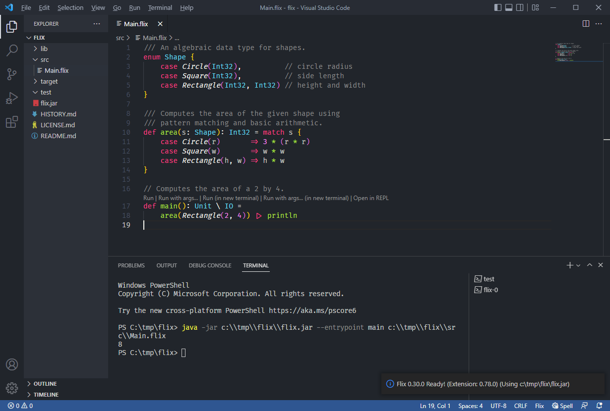
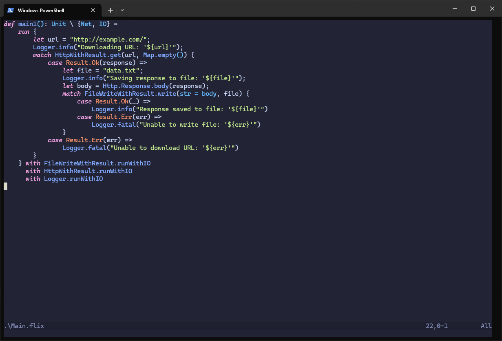

# はじめに

> 💡 **お知らせ**: このドキュメントはAIによって翻訳されています。表現に違和感がある場合は、[原文（英語）](https://doc.flix.dev/getting-started.html)を参照してください。

Flix を始めるのは簡単です。必要なのは [Java バージョン 21 以上](https://adoptium.net/temurin/releases/)だけです。

Java がインストールされているかどうか、またそのバージョンを確認するには、以下のコマンドを入力します：

```shell
$ java -version
```

以下のような出力が表示されるはずです：

```
openjdk version "21" 2023-09-19 LTS
OpenJDK Runtime Environment Temurin-21+35 (build 21+35-LTS)
OpenJDK 64-Bit Server VM Temurin-21+35 (build 21+35-LTS, mixed mode, sharing)
```

Java がインストールされていない場合や、バージョンが古い場合は、[Adoptium](https://adoptium.net/temurin/releases/) から新しいバージョンをダウンロードできます。

Java 21 以上をインストールしたら、以下の2つの方法で進めることができます：

- [Flix VSCode 拡張機能](https://marketplace.visualstudio.com/items?itemName=flix.flix)を使用する（__強く推奨__）、または
- コマンドラインから Flix コンパイラを実行する。

## VSCode で Flix を使う

Flix にはフル機能の VSCode プラグインが付属しています。以下の手順で始めましょう：

> 1. 新しい空のフォルダを作成します（例：`my-flix-project`）。
> 2. VSCode を開き、`File -> Open Folder` を選択します。
> 3. フォルダ内に `Main.flix` という名前の新しいファイルを作成します。
> 4. VSCode がマーケットプレイスで拡張機能を検索するかどうか尋ねてきます。「Yes」と答えてください。
> 5. Flix _拡張機能_ がダウンロードされ、インストールされます。完了すると、Flix _コンパイラ_ をダウンロードするかどうか尋ねてきます。再び「Yes」と答えてください。
> 6. 「Starting Flix」に続いて「Flix Ready!」と表示されたら、準備完了です。

Flix Visual Studio Code 拡張機能の動作中のスクリーンショット：



## Neovim で Flix を使う

Flix は [Neovim](https://neovim.io/) からも使用できます。以下の手順で始めましょう：
- [公式プラグイン](https://github.com/flix/nvim)は Neovim 0.11 でリリースされた機能に依存しています
- インストールされている Neovim のバージョンを確認してください

```shell
nvim --version
```

### Neovim プラグイン

ネイティブ Neovim LSP 用の LSP 設定と、Flix CLI と対話するためのいくつかの関数を提供する Lua [プラグイン](https://github.com/flix/nvim)があります。リポジトリには詳細なインストールと設定手順があります。
お好みのプラグインマネージャーでインストールするか、Neovim のランタイムパスにローカルでクローンできます。

プラグインはキーマッピングを提供しませんが、Flix LSP サーバーをセットアップし、デフォルトの LSP マッピングで動作するようにします。nvim 0.11 での LSP キーマッピングの設定例を以下に示します。`LspAttach` autocmd を設定すると、キーマッピングは*すべて*の設定された LSP サーバーに適用されます。

```lua
-- LSP サーバーがバッファにアタッチしたときにトリガーされる autocmd を作成
vim.api.nvim_create_autocmd('LspAttach', {
  -- autocmd の競合を防ぐために名前を付ける
  group = vim.api.nvim_create_augroup('my.lsp', {}),
  -- サーバーがアタッチしたときに実行する関数
  callback = function(args)
    -- オプションの説明文字列を持つキーバインディングオプションを設定するヘルパー関数
    -- !!! 重要 !!!
    -- `buffer` はこれらのマッピングを autocmd をトリガーするバッファのみに設定する
    local function get_opts(desc)
      return { desc = desc, buffer = args.buf, noremap = true, silent = true }
    end
    -- キーバインディングを設定する前に LSP クライアントが機能をサポートしているか確認
    local client = assert(vim.lsp.get_client_by_id(args.data.client_id))
    if client:supports_method('textDocument/format') then
      vim.keymap.set('n', '<leader>=', vim.lsp.buf.format, get_opts('format buffer'))
    end
    if client:supports_method('textDocument/rename') then
      vim.keymap.set('n', '<leader>rn', vim.lsp.buf.rename, get_opts('rename'))
    end
    vim.keymap.set("n", "<leader>ca", vim.lsp.buf.code_action, get_opts("lsp code action"))
    vim.keymap.set("n", "<leader>cl", vim.lsp.codelens.run, get_opts("lsp codelens run"))
    vim.keymap.set("n", "gr", vim.lsp.buf.references, get_opts("lsp references"))
    vim.keymap.set("n", "gd", vim.lsp.buf.definition, get_opts("lsp definition"))
    vim.keymap.set("n", "<leader>h", vim.lsp.buf.document_highlight, get_opts("lsp document highlight"))
    vim.keymap.set("n", "K", vim.lsp.buf.hover, get_opts("lsp hover"))
    vim.keymap.set("n", "gi", vim.lsp.buf.implementation, get_opts("lsp buf implementation"))
    vim.keymap.set('i', '<C-a>', '<C-x><C-o>', get_opts("manual expand completion"))
    vim.keymap.set("n", "<leader>rn", vim.lsp.buf.rename, get_opts(""))
    vim.keymap.set("n", "<leader>d", vim.diagnostic.open_float, get_opts("diagnostic open float"))
    vim.keymap.set("n", "<leader>ws", vim.lsp.buf.workspace_symbol, get_opts("lsp workspace symbol"))
    vim.keymap.set("n", "<leader>ds", vim.lsp.buf.document_symbol, get_opts("lsp doc symbol"))
  end
})
```

上記のスニペットは以下のキーバインディングを提供します。

| キーバインド      | アクション                   |
|-----------------|--------------------------|
| `gd`            | 定義へ移動         |
| `gi`            | 実装へ移動     |
| `gr`            | 参照を検索          |
| `ctrl+a`        | 自動補完をトリガー    |
| `shift+k`       | ホバー                    |
| `<leader>rn`    | シンボルの名前変更            |
| `<leader>ca`    | コードアクション             |
| `<leader>cl`    | コードレンズを実行            |
| `<leader>ws`    | ワークスペースシンボルを表示   |
| `<leader>ds`    | ドキュメントシンボルを表示    |
| `<leader>d`     | 診断を表示         |
| `<leader>h`     | ドキュメントハイライトを表示  |

> 以前は [lspconfig](https://github.com/neovim/nvim-lspconfig) が Neovim に LSP 機能と設定を提供していました。しかし、バージョン 0.11 以降、Neovim には LSP が組み込まれており、lspconfig は一般的な LSP サーバーの設定のみを提供します。これにより、インストールの必要性は減りましたが、まだ推奨されています。



### 手動設定

LSP サーバーを自分でセットアップしたい場合、プラグインのコードは以下の通りです。

1. nvim にどのファイルタイプが Flix ファイルかを伝える

```lua
vim.filetype.add({
  extension = {
    flix = "flix",
  }
})
```

2. Neovim のネイティブ LSP クライアント用に Flix LSP を設定する

```lua
-- "flix" が既にセットアップされているか確認
if not vim.lsp.config["flix"] then
  -- ネイティブ LSP 用の Flix LSP 設定を作成
  vim.lsp.config('flix', {
    -- `cmd` 定義のいずれか1つを選択
    -- プロジェクトローカルの `flix.jar` 用（プロジェクトのルートに flix.jar がインストールされている場合）
    cmd = { "java", "-jar", "flix.jar", "lsp" },
    -- グローバルな Flix インストール用（"homebrew" や "nix" など）
    cmd = {"flix", "lsp"},
    filetypes = { "flix" },
    root_markers = { "flix.toml" }, -- ルートディレクトリを設定する場所
    cmd_cwd = vim.fs.root(0, { 'flix.toml' }),
    root_dir = vim.fs.root(0, { 'flix.toml' }),
})
end
```

3. コメントやインデントなどの Flix のデフォルト設定を行い、Flix バッファが変更されるたびにコードレンズを実行する autocmd を作成する。

```lua
-- autocmd
-- autocmd の競合を防ぐために名前付き「グループ」を作成
local flix = vim.api.nvim_create_augroup("flix.ft", { clear = true })
local flix_lsp = vim.api.nvim_create_augroup("flix.lsp", { clear = true })
-- "flix" バッファに入ったときにアクティブになる autocmd
vim.api.nvim_create_autocmd("FileType", {
  group = flix,
  pattern = "flix",
  callback = function(args)
    vim.api.nvim_clear_autocmds({ group = flix_lsp, buffer = args.buf }) -- 重複を防ぐ
    -- Flix のデフォルト設定
    vim.opt_local.tabstop = 4
    vim.opt_local.shiftwidth = 4
    vim.opt_local.softtabstop = 4
    vim.bo.commentstring = "// %s"
    -- コードレンズを更新
    vim.api.nvim_create_autocmd({ 'BufEnter', 'CursorHold', 'InsertLeave' }, {
      group = flix_lsp,
      buffer = args.buf,
      callback = function()
        vim.lsp.codelens.refresh({ bufnr = args.buf })
      end
    })
  end
})
```

> このコードを `$HOME/.config/nvim/init.lua` または Neovim で LSP を設定している場所に配置してください。

## Emacs で Flix を使う

Flix は [Emacs](https://www.gnu.org/software/emacs/) からも使用できます。[flix-mode](https://codeberg.org/mdiin/flix-mode) パッケージをインストールしてください。そこに記載されている手順に従って、Emacs で Flix コードを書き始めましょう。

## コマンドラインで Flix を使う

Flix はコマンドラインからも使用できます。以下の手順に従ってください：

> 1. 新しい空のフォルダを作成します（例：`my-flix-project`）。
> 2. 最新の `flix.jar` を [https://github.com/flix/flix/releases/latest](https://github.com/flix/flix/releases/latest) からダウンロードし、フォルダに配置します。
> 3. 作成したディレクトリに移動し（例：`cd my-flix-project`）、`java -jar flix.jar init` を実行して空の Flix プロジェクトを作成します。
> 4. `java -jar flix.jar run` を実行してプロジェクトをコンパイルし、実行します。

## Nix で Flix をインストールする

Flix は [nix パッケージマネージャー](https://nixos.org/)を使用してインストールすることもできます。
現在実行中のシェルにインストールするには、以下を実行します：

```shell
$ nix-shell -p flix
```

または、グローバルにインストールするには：

```shell
$ nix-env -i flix
```

その後、プロジェクトディレクトリで `flix run` を実行します。

## トラブルシューティング

Flix が動作しない最も一般的な原因は、(a) `java` コマンドが `PATH` に含まれていない、(b) `JAVA_HOME` 環境変数が設定されていないか、間違って設定されている、(c) 間違ったバージョンの Java がインストールされている、のいずれかです。これらの問題をデバッグするには、以下を確認してください：

- コマンド `java -version` が正しい Java バージョンを表示すること。
- `JAVA_HOME` 環境変数が正しく設定されていること。
    - Windows では、`echo %JAVA_HOME%` と入力して変数を表示できます。
    - Mac および Linux では、`echo $JAVA_HOME` と入力して変数を表示できます。

まだ問題が解決しない場合は、[Zulip](https://flix.zulipchat.com/) でヘルプを求めることができます。

<!--
# Getting Started

Getting started with Flix is straightforward. All you need is [Java version 21+](https://adoptium.net/temurin/releases/).

You can check if Java is installed and its version by typing:

```shell
$ java -version
```

which should print something like:

```
openjdk version "21" 2023-09-19 LTS
OpenJDK Runtime Environment Temurin-21+35 (build 21+35-LTS)
OpenJDK 64-Bit Server VM Temurin-21+35 (build 21+35-LTS, mixed mode, sharing)
```

If Java is not installed or your version is too old, a newer version can be
downloaded from [Adoptium](https://adoptium.net/temurin/releases/).

Once you have Java 21+ installed there are two ways to proceed:

- You can use the [Flix VSCode extension](https://marketplace.visualstudio.com/items?itemName=flix.flix) (__highly recommended__) or
- You can run the Flix compiler from the command line.

## Using Flix from VSCode

Flix comes with a fully-featured VSCode plugin. Follow these steps to get
started:

> 1. Create a new empty folder (e.g. `my-flix-project`).
> 2. Open VSCode and choose `File -> Open Folder`.
> 3. Create a new file called `Main.flix` in the folder.
> 4. VSCode will ask you want to search the marketplace for extensions. Say "Yes".
> 5. The Flix _extension_ will be downloaded and installed. Once done, it will
>    ask if you want to download the Flix _compiler_. Say "Yes" again.
> 6. When you see "Starting Flix" followed by "Flix Ready!" everything should be ready.

A screenshot of the Flix Visual Studio Code extension in action:


## Using Flix from Neovim

Flix can also be used from [Neovim](https://neovim.io/). Follow these steps to
get started:
- the [official plugin](https://github.com/flix/nvim) relies on features released in Neovim 0.11
- check the version of neovim installed

```shell
nvim --version
```

### Neovim Plugin

There is a Lua [plugin](https://github.com/flix/nvim) which provides an LSP configuration for the native neovim lsp, and several functions to interact with the flix cli. It's repo has detailed installation and configuration instructions.
It can be installed with a plugin manager of choice or cloned locally into your neovim runtime path.

The plugin provides no Keymappings but sets the Flix LSP server up, allowing it to work with your default LSP mappings. An example of setting up LSP keymappings with nvim 0.11 can be seen below. Once your `LspAttach` autocmd has been set the keymappings will apply to *all* configured lsp servers.

```lua
-- create auto command that is triggered when your LSP server attatches to the buffer
vim.api.nvim_create_autocmd('LspAttach', {
  -- give it a name to prevent autocmd conflicts
  group = vim.api.nvim_create_augroup('my.lsp', {}),
  -- the function to run when the server attatches
  callback = function(args)
    -- helper function to set keybinding options with an optional description string
    -- !!! important !!!
    -- `buffer` makes these mappings local to the buffer triggering the autocmd
    local function get_opts(desc)
      return { desc = desc, buffer = args.buf, noremap = true, silent = true }
    end
    -- check that the LSP client supports features before setting bindings
    local client = assert(vim.lsp.get_client_by_id(args.data.client_id))
    if client:supports_method('textDocument/format') then
      vim.keymap.set('n', '<leader>=', vim.lsp.buf.format, get_opts('format buffer'))
    end
    if client:supports_method('textDocument/rename') then
      vim.keymap.set('n', '<leader>rn', vim.lsp.buf.rename, get_opts('rename'))
    end
    vim.keymap.set("n", "<leader>ca", vim.lsp.buf.code_action, get_opts("lsp code action"))
    vim.keymap.set("n", "<leader>cl", vim.lsp.codelens.run, get_opts("lsp codelens run"))
    vim.keymap.set("n", "gr", vim.lsp.buf.references, get_opts("lsp references"))
    vim.keymap.set("n", "gd", vim.lsp.buf.definition, get_opts("lsp definition"))
    vim.keymap.set("n", "<leader>h", vim.lsp.buf.document_highlight, get_opts("lsp document highlight"))
    vim.keymap.set("n", "K", vim.lsp.buf.hover, get_opts("lsp hover"))
    vim.keymap.set("n", "gi", vim.lsp.buf.implementation, get_opts("lsp buf implementation"))
    vim.keymap.set('i', '<C-a>', '<C-x><C-o>', get_opts("manual expand completion"))
    vim.keymap.set("n", "<leader>rn", vim.lsp.buf.rename, get_opts(""))
    vim.keymap.set("n", "<leader>d", vim.diagnostic.open_float, get_opts("diagnostic open float"))
    vim.keymap.set("n", "<leader>ws", vim.lsp.buf.workspace_symbol, get_opts("lsp workspace symbol"))
    vim.keymap.set("n", "<leader>ds", vim.lsp.buf.document_symbol, get_opts("lsp doc symbol"))
  end
})
```

The snippet above provides the following keybindings.

| Keybinding      | Action                   |
|-----------------|--------------------------|
| `gd`            | Go to definition         |
| `gi`            | Go to implementation     |
| `gr`            | Find references          |
| `ctrl+a`        | Trigger auto-complete    |
| `shift+k`       | Hover                    |
| `<leader>rn`    | Rename symbol            |
| `<leader>ca`    | Code actions             |
| `<leader>cl`    | Run Code lens            |
| `<leader>ws`    | Show workspace symbols   |
| `<leader>ds`    | Show document symbols    |
| `<leader>d`     | Show diagnostics         |
| `<leader>h`     | Show document highlight  |

> Previously [lspconfig](https://github.com/neovim/nvim-lspconfig) provided LSP functionality to neovim and lsp configurations. However, after version 0.11 neovim has LSP built in, lspconfig only provides configurations for common lsp servers. This makes its installation less necessary but it is still recommended.


### Manual Configuration

If you would rather setup the LSP server yourself the code from the plugin is as follows.

1. Tell nvim what filetypes are Flix files

```lua
vim.filetype.add({
  extension = {
    flix = "flix",
  }
})
```

2. Configure the Flix LSP for neovim's native LSP client

```lua
-- check if "flix" has already been setup
if not vim.lsp.config["flix"] then
  -- create flix LSP configuration for native LSP
  vim.lsp.config('flix', {
    -- choose just one `cmd` definition
    -- for a project local `flix.jar` ie flix.jar is installed in the root of your project
    cmd = { "java", "-jar", "flix.jar", "lsp" },
    -- for a global flix installation ie with "homebrew" or "nix"
    cmd = {"flix", "lsp"},
    filetypes = { "flix" },
    root_markers = { "flix.toml" }, -- where to set the root directory
    cmd_cwd = vim.fs.root(0, { 'flix.toml' }),
    root_dir = vim.fs.root(0, { 'flix.toml' }),
})
end
```

3. Create an autocmd to set flix defualts such as comments and indenting, and to run the codelens whenever your flix buffer changes.

```lua
-- auto commands
-- create named "groups" to prevent autocmd conflicts
local flix = vim.api.nvim_create_augroup("flix.ft", { clear = true })
local flix_lsp = vim.api.nvim_create_augroup("flix.lsp", { clear = true })
-- autocmd that activates when a "flix" buffer is entered
vim.api.nvim_create_autocmd("FileType", {
  group = flix,
  pattern = "flix",
  callback = function(args)
    vim.api.nvim_clear_autocmds({ group = flix_lsp, buffer = args.buf }) -- prevent duplicates
    -- set flix defaults
    vim.opt_local.tabstop = 4
    vim.opt_local.shiftwidth = 4
    vim.opt_local.softtabstop = 4
    vim.bo.commentstring = "// %s"
    -- refresh codelens
    vim.api.nvim_create_autocmd({ 'BufEnter', 'CursorHold', 'InsertLeave' }, {
      group = flix_lsp,
      buffer = args.buf,
      callback = function()
        vim.lsp.codelens.refresh({ bufnr = args.buf })
      end
    })
  end
})
```

> place this code in your `$HOME/.config/nvim/init.lua` or wherever you configure your lsp in neovim.

## Using Flix from Emacs

Flix can be used from [Emacs](https://www.gnu.org/software/emacs/) as well by installing the [flix-mode](https://codeberg.org/mdiin/flix-mode) package. Follow the instructions there to get started writing Flix code in Emacs.

## Using Flix from the CLI

Flix can also be used from the command line. Follow these steps:

> 1. Create a new empty folder (e.g. `my-flix-project`).
> 2. Download the latest `flix.jar` from [https://github.com/flix/flix/releases/latest](https://github.com/flix/flix/releases/latest) and put it into the folder.
> 3. Enter the created directory (e.g. `cd my-flix-project`) and run `java -jar flix.jar init` to create an empty Flix project.
> 4. Run `java -jar flix.jar run` to compile and run the project.

## Installing Flix with Nix

Flix can also be installed using the [nix package manager](https://nixos.org/).
To install for the currently running shell run:

```shell
$ nix-shell -p flix
```

Or alternatively to install globally:

```shell
$ nix-env -i flix
```

Then run `flix run` in your project directory.

## Troubleshooting

The most common reasons for Flix not working are (a) the `java` command not
being on your `PATH`, (b) the `JAVA_HOME` environmental variable not being set
or being set incorrectly, or (c) having the wrong version of Java installed. To
debug these issues, ensure that:

- The command `java -version` prints the right Java version.
- The `JAVA_HOME` environmental variable is correctly set.
    - On Windows, you can print the variable by typing `echo %JAVA_HOME%`.
    - On Mac and Linux, you can print the variable by typing `echo $JAVA_HOME`.

If you are still stuck, you can ask for help on [Zulip](https://flix.zulipchat.com/).
-->

